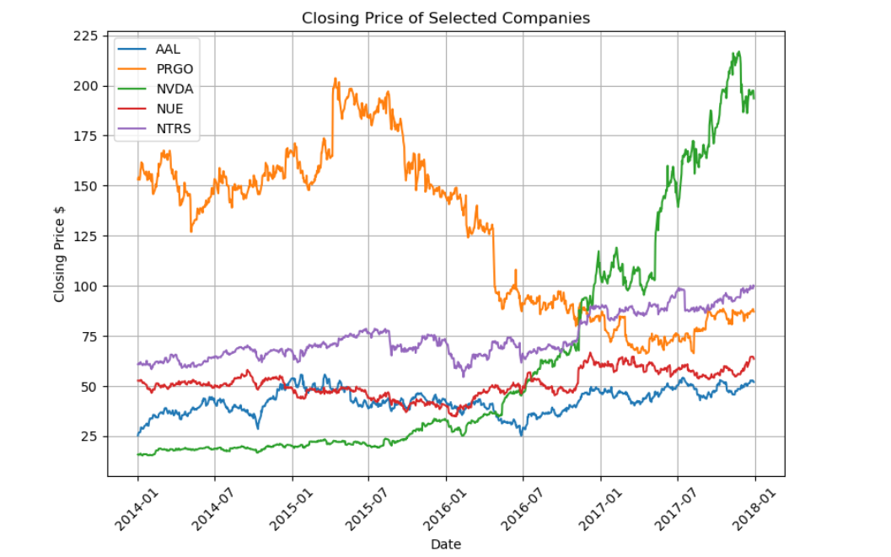
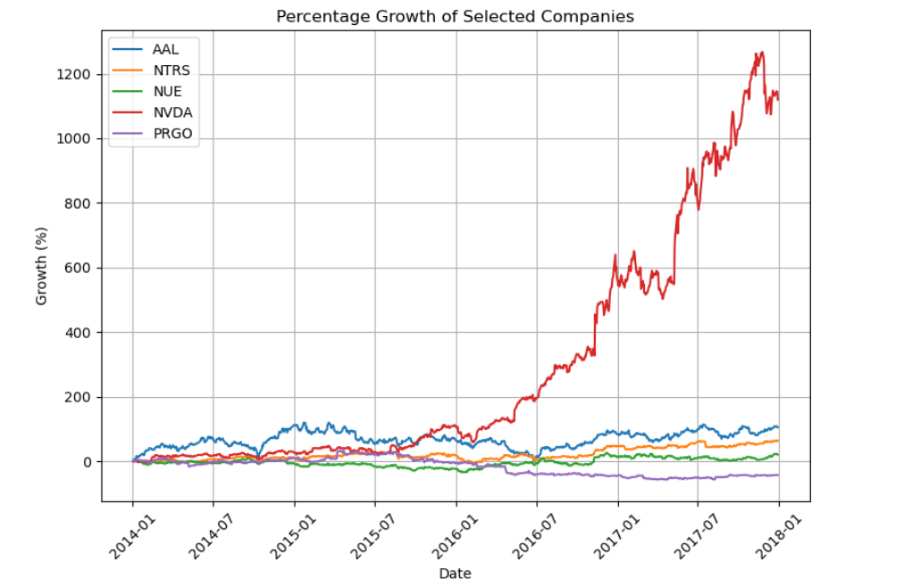
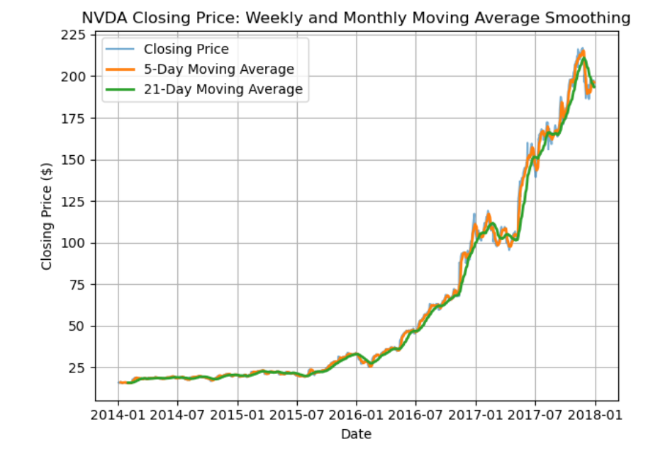
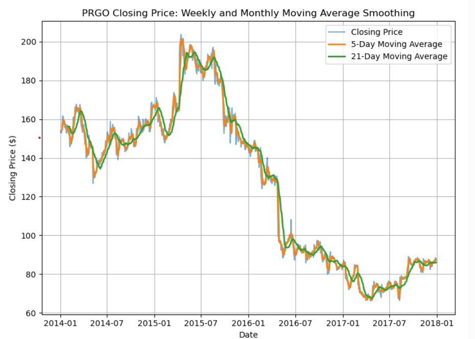

# TIME SERIES ANALYSIS- STOCK PRICE

**Project Overview**
This project is part of my internship tasks for Codveda Technologies. I performed a time-series analysis of historical stock-price data using Python, Pandas, Matplotlib, Seaborn, and Statsmodels to explore trends, volatility, recurring patterns and underlying price movements over time.

**Objectives**
•	Plot time-series data and identify patterns.
•	Decompose selected series into trend, seasonality, and residual components.
•	Perform and visualize moving-average smoothing.

**Portfolio Files**
•	[Stock Price dataset]((2)%Stock%Prices%Data%Set.csv)
•	[Jupyter Notebook](Time%Series%Analysis-Stock%Price.ipynb)
•	[PDF Copy of Notebook](Time%Series%Analysis-Stock%Price.pdf)
•	[PDF Report](Time_Series_Analysis_Stock_Price_Report.pdf)

**PROJECT WORKFLOW**

  **1. Data Exploration**
During data exploration, I examined:
•	Data size (rows and columns)
•	Missing values
•	Data types of records
•	Unique values in the categorical column (symbol)
•	Summary statistics of numerical columns

  **2. Stock Selection**
Rather than selecting companies arbitrarily, I identified top 5 stocks with the maximum number of observations. These companies were used for the comparative stage of the analysis.

  **3. Percentage Growth Analysis**
The analysis showed the cumulative-growth performance of selected stock. The the strongest and weakest cumulative-growth performers were subjects for further analysis.

  **4. Daily Volatility Analysis**
Daily returns were calculated from consecutive closing prices, and their standard deviation was used as the volatility measure.

  **5. Seasonal Decomposition**
An additive seasonal decomposition with a 252-trading-day period was performed on NVDA and PRGO, the strongest and weakest cumulative-growth performers respectively.

# VISUALIZATIONS

# Conclusion
This project demonstrates how multiple time-series techniques can be combined to investigate historical financial data. Percentage growth, volatility analysis, seasonal decomposition, and moving-average smoothing provided complementary perspectives on stock-price behaviour.
The analysis highlighted a strong upward trajectory for NVDA and a prolonged decline followed by stabilization for PRGO.

# Disclaimer!
This project is intended for educational and analytical purposes only. The analysis is based on historical stock-price data and should not be interpreted as financial or investment advice.

Joy Amadi-Onwubiko

*"Polishing my skills, one project at a time."*
